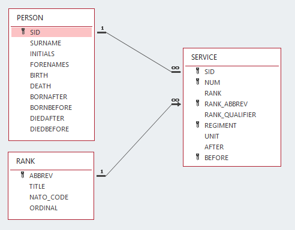

# Schema

## Relational schema
Relational database schema for Microsoft Access and Apache Derby can be found in the **access** and **derby** folders respectively.

The database is very simple, essentially just name, rank and number. Each soldier has a single *PERSON* record and one or more *SERVICE* records that represent the soldier's service history. The *RANK* table ensures that the ranks recorded in service records are standardised, and allows for queries over a range of ranks (Officers, NCOs, etc.)

## XML schema
This repository also contains an XML schema definition (XSD) for **Soldiers XML**. The format is designed to capture the information used in the database (names, dates and service records), but also includes a *notes* element that will allow ad hoc notes to be attached to each *person* element.

The aim is to produce an XML document that can be used to add data to a *soldiers* database or publish information from it. At the same time, the format can be used to capture records about soldiers from any source; with name rank and number recored formally, and any ancillary information captured as *notes*.

Some [XSLT](https://en.wikipedia.org/wiki/XSLT) stylesheets for creating and transforming Soliders XML can also be found in this repository. See the [format](format) and [report](report) folders.

## Database tools
Java utilities for populating and querying a Soldiers database can be found in the [soldiers-java](https://github.com/tigersmuseum/soldiers-java) repository.